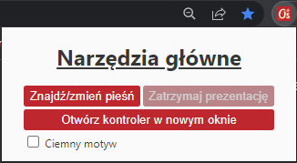
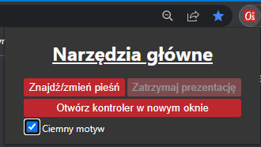
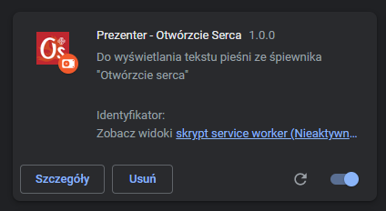
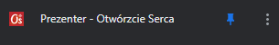
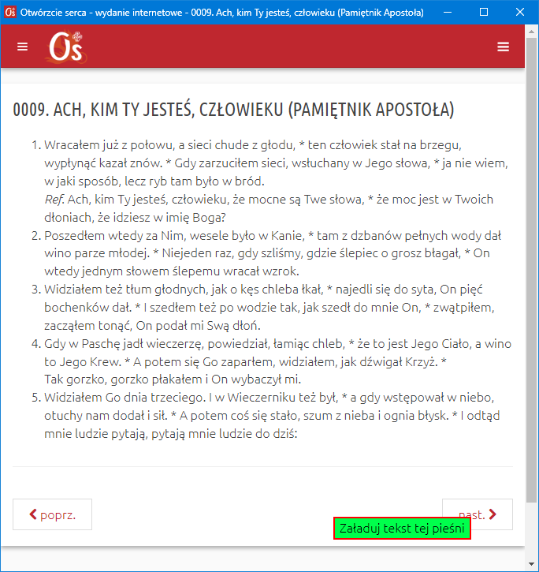
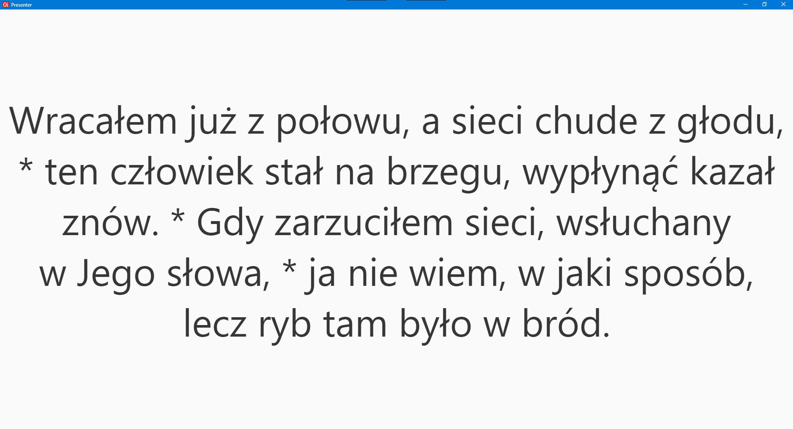
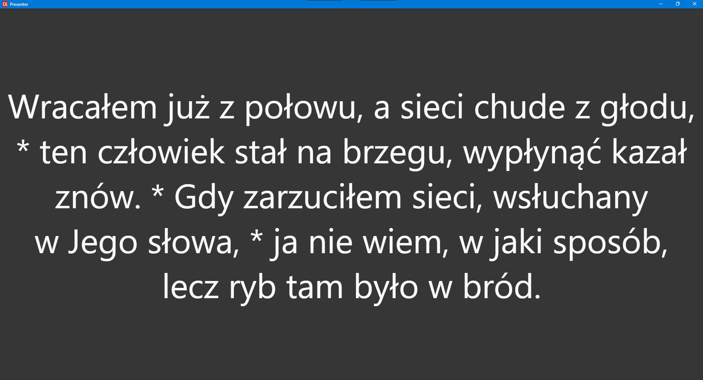
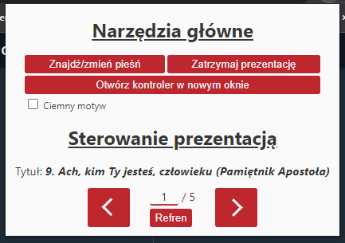
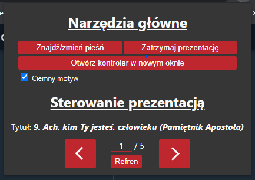

# Presenter do "*Otwórzcie Serca*"

### Wtyczka do Chrome'a spięta z internetowym wydaniem śpiewnika "*Otwórzcie Serca*"

- Łatwe w obsłudze, 
- pozwala na wyświetlanie tekstu pieśni na ekranie bez konieczności tworzenia osobnej prezentacji.

---
## Wgrywanie wtyczki:
1. Wejdź w przeglądarce Chrome na adres: [chrome://extenstions](chrome://extenstions)
2. Włącz tryb dewelopera(suwak po prawej stronie)
3. Naciśnij przycisk: **Załaduj rozpakowane**
4. Przejdź do folderu *`plugin`* i naciśnij: **Wybierz folder**
5. Wtyczka zostanie dodana, pojawi się na stronie taki kafelek:

Warto przypiąć tą wtyczkę do paska. Żeby to zrobić należy kliknąć na górze na biały puzzel. Pojawi się wtedy lista wszystkich zainstalowanych wtyczek. Należy nacisnąć wtedy na pinezkę, kafelek pojawi się wtedy na górze w pasku

---
## Szybka instrukcja:
1. Naciśnij na ikonkę wtyczki, Otwórzcie serca
2. Pojawi się `Kontroler` / `Centrum sterowania`. Naciśnij **Znajdź/zmień pieśń**
3. Pojawi się okienko z listą pieśni do wyboru. Wybierz jedną z nich, a potem kliknij "**Załaduj tekst tej pieśni**":

4. Pojawi się kolejne okno zatytułowane: `Presenter`. Na nim będzie wyświetlać się tekst pieśni. Otwórz to na odpowiednim ekranie. Aby otworzyć je w pełnym ekranie naciśnij na klawiaturze **F12**;

`Centrum sterowania`/`Kontroler` Wygląda w ten sposób:

 

Prezentacją można sterować z poziomu "**Centrum Sterowania**(które można otworzyć w oddzielnym ekranie po naciśnięciu przycisku: "**Otwórz kontroler w nowym oknie**"), albo poprzez używanie strzałek i spacji gdy okno `Presenter` jest aktywne
## Dodano(wersja 1.0.1):
- [x] Link do strony, skąd tekst pieśni został pobrany(w tytule pieśni)
- [x] Wygaszanie prezentera (z poziomu klawiatury lub z poziomu `Kontrolera`) 
- [x] Możliwość dodawania własnego tekstu(szczególnie użyteczne przy wyświetlaniu tekstu psalmu)
- [x] Możliwość pobierania tekstu pieśni
- [x] Mozliwość załadowania tekstu z poziomu prezentacji(pod klawiszami `l`(z internetu) i `p`(z pobranych + własny tekst))
## W przyszłości:
- [ ] Możliwość otwarcia `Prezentera` na pełny ekran z poziomu `Kontrolera`
- [ ] Możliwość kontrolowania prezentacją z poziomu telefonu, lub innego zewnętrzengo urządzenia
- [ ] Wtyczka będzie bardziej zoptymalizowana(m.in nie będzie niepotrzebnego pobierania danych, może połączenie z bazą danych...)